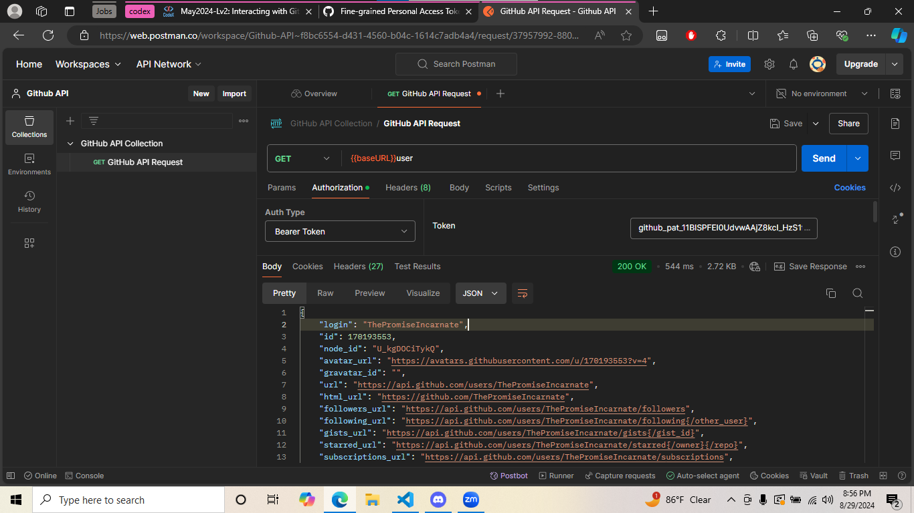
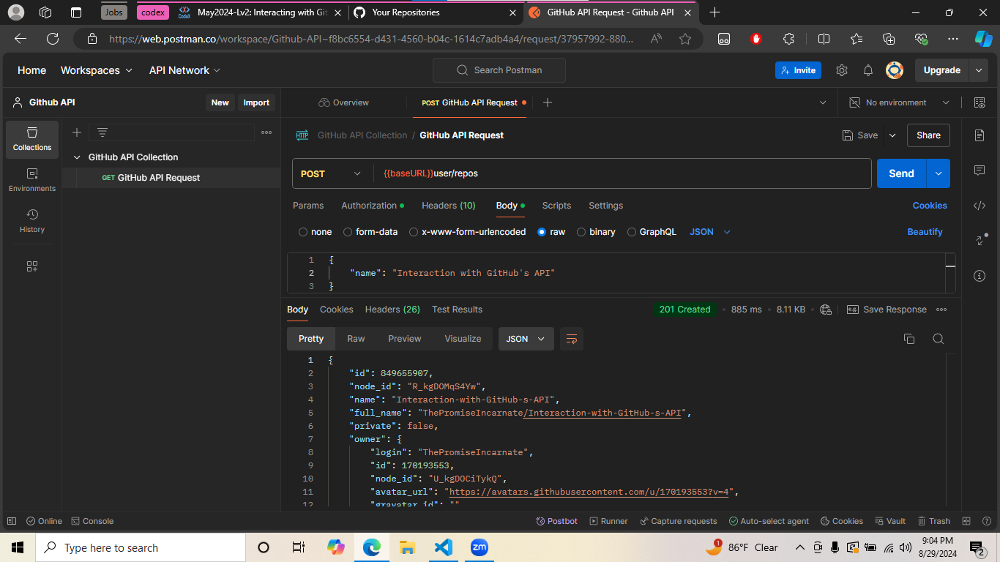

# postman-reflection

## Introduction to APIs

### Cyndaquil

https://pokeapi.co/api/v2/pokemon/cyndaquil

Cyndaquil has one Ability, Blaze, and one Hidden Ability, Flash Fire. Cyndaquil is a mono Fire type Pokemon, mono meaning it doesn't have a secondary type. Cyndaquil's Base Stats are:
- HP: 39
- Attack: 52
- Defense: 43
- Special Attack: 60
- Special Defense: 50
- Speed: 65

### Zangoose

https://pokeapi.co/api/v2/pokemon/zangoose

Zangoose has one Ability, Immunity, and one Hidden Ability, Toxic Boost. Zangoose is a mono Normal type Pokemon. Zangoose's Base Stats are:
- HP: 73
- Attack: 115
- Defense: 60
- Special Attack: 60
- Special Defense: 60
- Speed: 90

### Rayquaza

https://pokeapi.co/api/v2/pokemon/rayquaza

Rayquaza has one Ability, Air Lock. Rayquaza is a dual Dragon/Flying type Pokemon, dual meaning it has two types. Rayquaza's Base Stats are:
- HP: 105
- Attack: 150
- Defense: 90
- Special Attack: 150
- Special Defense: 90
- Speed: 95

## Exploring the Weather API

I got a status code of 200, meaning that everything was okay, but I used the wrong link, so instead of GETting the data for the city I was looking for, it gave me the HTML of the page.

Oops.

http://api.weatherbit.io/v2.0/current?key=4d8e0d0606654f008fbd84ed49c7604f&city=Shreveport,Louisiana

I got another status code of 200, meaning that everything was okay. The current temperature in Shreveport, Lousisiana as of this GET request is 34.2 °C, the weather description says "overcast clouds", and this city is in the American/Chicago timezone. 

## Interacting with GitHub's API

1. Go to the Settings of your GitHub account.
2. Scroll down until you see "Developer settings" and click that.
3. Click on "Personal access tokens", then "Fine-grained tokens".
4. Click the "Generate new token" button.
5. Give your token a name, set the "Repository access" to "All repositories", then set the "Repository permissions" for "Administration" and "Contents" to "read and write".
6. Copy the token - WARNING: be sure to paste it in a secure document somewhere so that you can have easy access to it after this. If you lose it and don't have this page open anymore, you'll have to make a new token.
7. Go to Postman and create a workspace. Once you've set up your workspace, paste your token in the Authorization section as a Bearer Key then Send a GET request on "https://api.github.com/user".

1. Do all the above steps, but change the request type from GET to POST. 
2. Go to Body, set it to "raw", then type this in: `{"name": "name of your repo"}`
3. When you click "Send" and check your Repositories on your account, a new Repo should have been created by Postman.