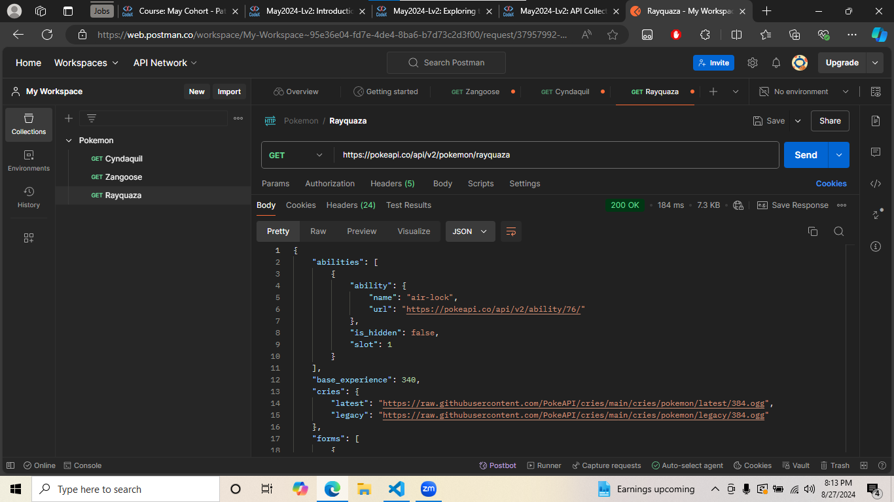

# postman-reflection

## Introduction to APIs

### Cyndaquil

https://pokeapi.co/api/v2/pokemon/cyndaquil

Cyndaquil has one Ability, Blaze, and one Hidden Ability, Flash Fire. Cyndaquil is a mono Fire type Pokemon, mono meaning it doesn't have a secondary type. Cyndaquil's Base Stats are:
- HP: 39
- Attack: 52
- Defense: 43
- Special Attack: 60
- Special Defense: 50
- Speed: 65

### Zangoose

https://pokeapi.co/api/v2/pokemon/zangoose

Zangoose has one Ability, Immunity, and one Hidden Ability, Toxic Boost. Zangoose is a mono Normal type Pokemon. Zangoose's Base Stats are:
- HP: 73
- Attack: 115
- Defense: 60
- Special Attack: 60
- Special Defense: 60
- Speed: 90

### Rayquaza

https://pokeapi.co/api/v2/pokemon/rayquaza

Rayquaza has one Ability, Air Lock. Rayquaza is a dual Dragon/Flying type Pokemon, dual meaning it has two types. Rayquaza's Base Stats are:
- HP: 105
- Attack: 150
- Defense: 90
- Special Attack: 150
- Special Defense: 90
- Speed: 95

## Exploring the Weather API

I got a status code of 200, meaning that everything was okay, but I used the wrong link, so instead of GETting the data for the city I was looking for, it gave me the HTML of the page.

Oops.

http://api.weatherbit.io/v2.0/current?key=4d8e0d0606654f008fbd84ed49c7604f&city=Shreveport,Louisiana

I got another status code of 200, meaning that everything was okay. The current temperature in Shreveport, Lousisiana as of this GET request is 34.2 °C, the weather description says "overcast clouds", and this city is in the American/Chicago timezone. 

